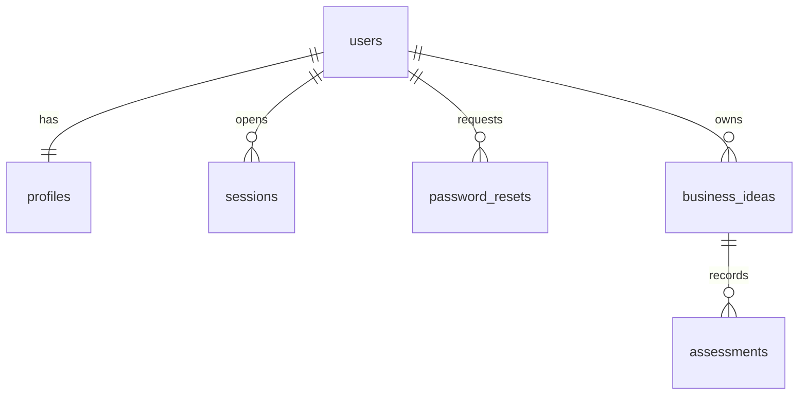

# Sprint 1 data model

- `users`: UUID, unique email, password hash, role, account status, timestamps.
- `profiles`: user FK, display name, location, description, role-specific JSON, visibility, timestamps.
- `sessions`: user FK, unique token hash, expiry, creation time.
- `password_resets`: user FK, unique token hash, expiry, consumption time, creation time.
- `business_ideas`: owner FK, title, problem, solution, industry, stage, location, customers, budget, current challenges, visibility, revision, timestamps.
- `assessments`: idea FK, revision/input snapshot, seven assessment sections, status/error, monotonic identity sequence, timestamps.

`alembic_version` is migration bookkeeping. All five foreign keys cascade when their parent is deleted. Private idea details and all assessment records are owner-only. Registered visibility returns a reduced summary. New passwords use bcrypt-SHA256; existing bcrypt hashes still verify. Session/reset secrets are stored only as SHA-256 hashes.

Migrations are authoritative for runtime and tests. Enum columns store uppercase member names; APIs expose lowercase values. Each assessment attempt is separate, so failure retains the latest successful record.
